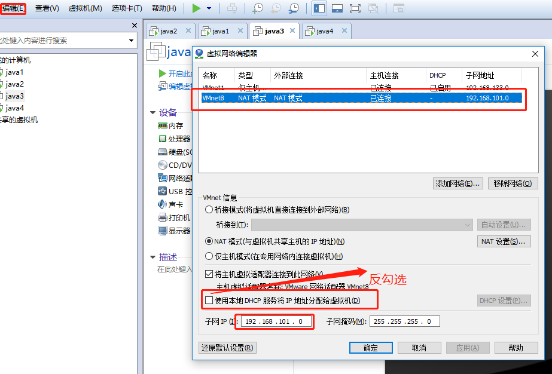
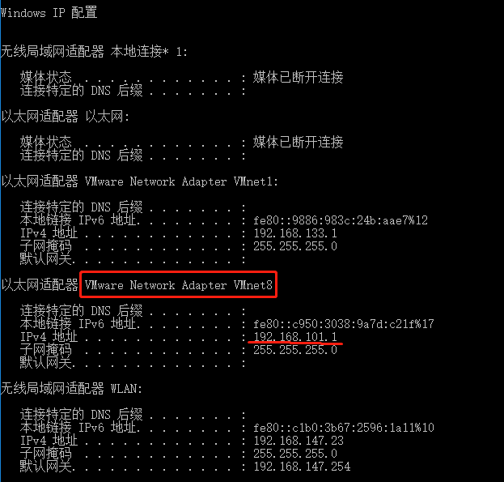
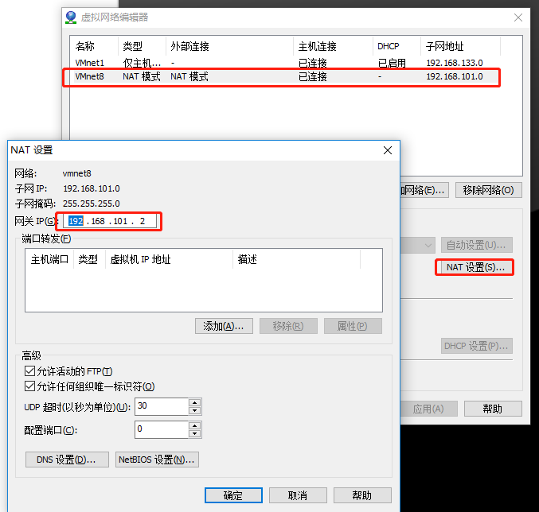
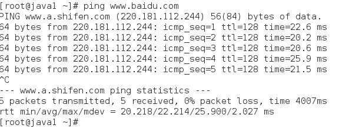
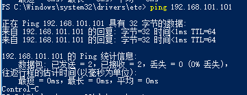
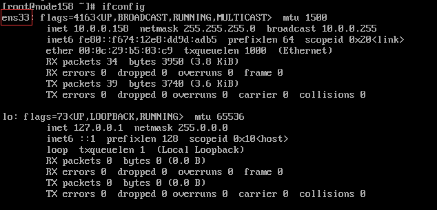
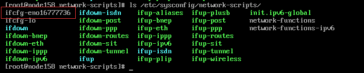
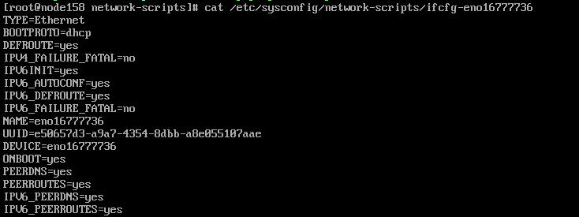
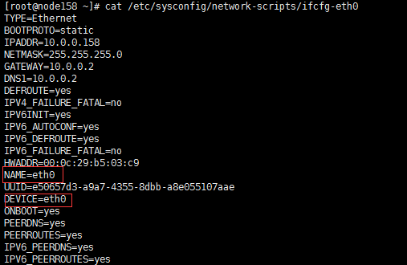
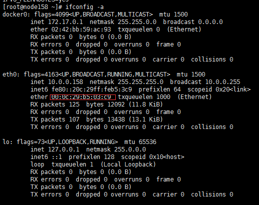

* content
{:toc}


### 在VMware中配置VMnet8

1.编辑 > 虚拟网络编辑器。选择VMnet8。配置子网IP:192.168.101.0。
去掉Use local DHCP service to distribute IP address to VMs选项。




2.可以看到虚拟网卡VMnet8的IP变成了192.168.101.1



3.查看网关。编辑 > 虚拟网络编辑器 > 选择VMnet8 > Nat设置。
可以看到网关的IP为192.168.101.2。




### 配置虚拟机的静态IP

1.CentOS配置网关。
```bash
vi /etc/sysconfig/network
```

```text
NETWORKING=yes
HOSTNAME=centos64idx1
GATEWAY=192.168.101.2
```

2.修改网卡配置。配置IP为192.168.101.***。
这里DNS1是必须要设置的否则无法进行域名解析。（主要修改IPADDR、BOOTPROTO和DNS1）

```bash
vi /etc/sysconfig/network-scripts/ifcfg-***
```

```text
#BOOTPROTO=dhcp
BOOTPROTO=static
IPADDR=192.168.101.101
NETMASK=255.255.255.0
DNS1=192.168.101.2
```
3.修改resolv.conf
```bash
vi /etc/resolv.conf
```
```text
nameserver 192.168.101.2
```
4.重启网卡
```bash
systemctl restart network
```
### 检查网络

1.虚拟机ping外网



2.本主机ping虚拟机。在cmd中ping 192.168.101.130



### 采坑指南

#### VMware克隆的centos7虚拟机网卡配置失败

新克隆的虚拟机ifconfig显示网卡的配置如下



可以看出网卡的名称是ens33，进入网卡配置文件目录，并没有ens33网卡配置，只有centos7默认的eno16777736



看一下配置的内容




**解决办法**

注意网卡配置名是已经修改成eth0以后执行下面操作，一共修改的地方有三处，
第一处网卡名：/etc/sysconfig/network-scripts/`ifcfg-eth0` ，
第二处配置文件里面：NAME=`eth0`，第三处也是配置文件里面：DEVICE=`eth0`



HWADDR的值一定要与eth0的值一直否则会网卡启动会失败



重启系统reboot就能生效了。
